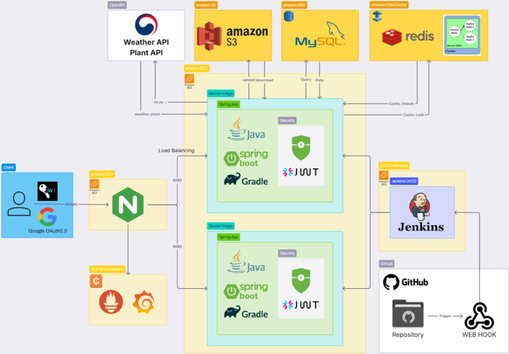
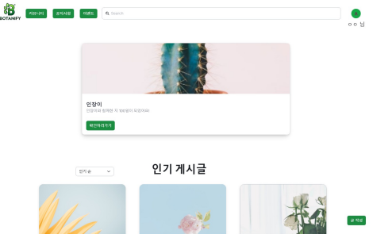
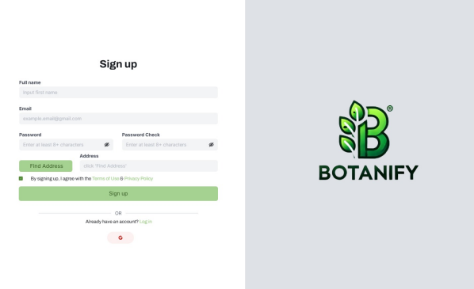
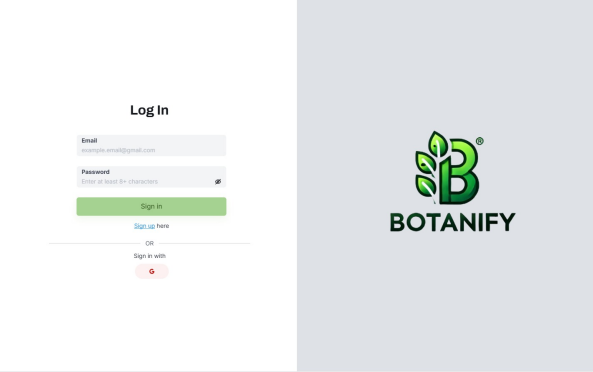
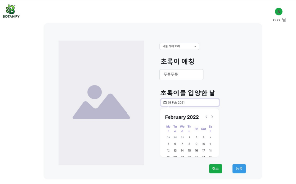
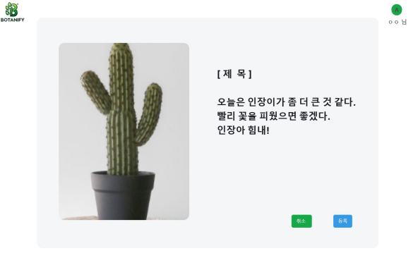
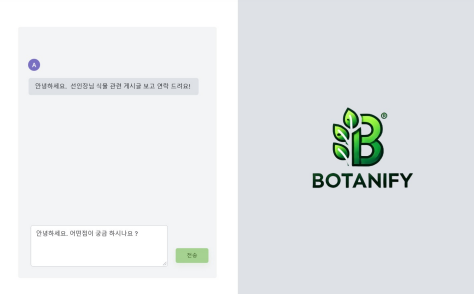
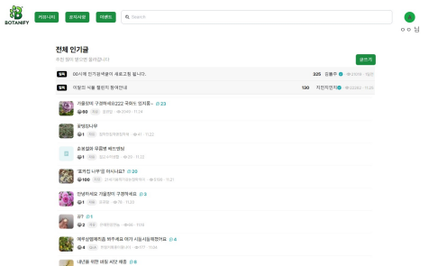

# Botanify
- 식물 성장 기록 & 정보 공유 커뮤니티 서비스
<br>

## 🌱 목차
- [서비스 소개](#-서비스-소개)
- [기술 스택](#-기술-스택)
- [프로젝트 설치 및 실행법](#-프로젝트-설치-및-실행법)
- [프로젝트 구조](#-프로젝트-구조)
- [주요기능](#-주요기능)
- [Developer](#-developer)
  

## 💁‍♀️ 서비스 소개
🗓️ 개발기간: 2024.12.02 ~ 2025.01.07 <br>
🪴 Botanify
- 사용자가 자신의 식물을 관리하고, 성장 상태를 기록하며, 식물 관련 정보를 공유할 수 있도록 돕는 애플리케이션입니다.
- 저희의 목표는 식물 성장 일지를 기록하고 정보를 공유하는 커뮤니티 서비스를 제공하여, 사용자들의 식집사 생활을 더 쉽고 재미있게 만드는 것입니다.
<p><a href="https://youtu.be/qxtP6wpPeYA">🎥 시연영상</a></p>


## 🔧 기술 스택
#### 💻 Backend


#### ⚙️ DevOps & Infrastructure


#### 🛠 Development & Database


#### 🔍 Testing & Monitoring


#### 🔌 External Services


#### 🎨 Design & Collaboration


## ⚙️ 프로젝트 설치 및 실행법
#### 1. **필수 요구 사항**
프로젝트 실행 전에 아래 환경이 필요합니다.

- **Java 17** 이상
- **MySQL 8.0**
- **Docker**
- **Git**
- **IDE** (IntelliJ, Eclipse 등)

#### 2. **프로젝트 클론**

```bash
$git clone https://github.com/sparta-Sounganization/Botanify.git
$cd Botanify
```

#### 3. **파일 설정**

`src/main/resources/application.yml` 파일을 수정하여 데이터베이스 및 기타 설정을 업데이트하세요.

<details>
<summery>

```bash
spring:
  jpa:
    open-in-view: false
    hibernate:
      ddl-auto: none
    properties:
      hibernate:
        show_sql: true
        dialect: org.hibernate.dialect.MySQL8Dialect
  jackson:
    time-zone: Asia/Seoul

  # mySQL Configuration
  datasource:
    driver-class-name: com.mysql.cj.jdbc.Driver
    url: ${사용자의_mySQL_엔드포인트}
    username: ${mySQL_사용자_이름}
    password: ${mySQL_사용자_암호}

  # JWT Configuration
  jwt:
    secret:
      key: ${base64로_암호화된_JWT_비밀_키}
      expiration: 3600000 # 1시간

  # Google OAuth2 Configuration
  security:
    oauth2:
      client:
        registration:
          google:
            client-id: {Google_Client_ID}
            client-secret: {Google_Client_비밀_키}
            redirect-uri: "{baseUrl}/login/oauth2/code/{registrationId}"
            scope:
              - profile
              - email

  # Redis Configuration
  redis:
    master:
      port: 6379
      host: ${사용자의 Redis 클라이언트 엔드포인트}
    verification:
      ttl: 300  # 5분
      max-attempts: 5
      attempts-ttl: 3600 # 1시간

  # Email Configuration
  mail:
    host: smtp.gmail.com
    port: 587
    username: ${서비스_이메일_발신_이름}
    password: ${서비스_이메일_발신_암호}
    properties:
      mail:
        smtp:
          auth: true
          starttls:
            enable: true

# ============= ^ Spring ^ ============= v External v =============


# Global Logging Configuration
logging:
  level:
    org.springframework.security: INFO
    com.sounganization.botanify: DEBUG
    org.springframework.web: DEBUG
    io.github.resilience4j.circuitbreaker: DEBUG


# S3 Configuration
aws:
  s3:
    bucket: ${S3_버킷_이름}
    endpoint: ${S3_버킷_PUT_엔드포인트}
    gateway: ${S3_버킷_GET_게이트웨이}
  access-key: ${S3_인증_키}
  secret-key: ${S3_비밀_키}


# Monitoring Configuration
management:
  endpoints:
    web:
      exposure:
        include: circuitbreakers, health, info, prometheus


# Kakao API Configuration
kakao:
  api:
    key: ${kakao_인증_키}
    base-url: ${kakao_엔드포인트}


# weather API Configuration
weather:
  api:
    key: ${weather_인증_키}
    base-url: ${weather_엔드포인트}


# CircuitBreaker Configuration
resilience4j:
  circuitbreaker:
    instances:
      weatherService:
        slidingWindowType: COUNT_BASED # 슬라이딩 윈도우 타입
        slidingWindowSize: 10 # 슬라이딩 윈도우 크기
        minimumNumberOfCalls: 5 # 최소 호출 수
        failureRateThreshold: 50 # 실패율 임계값
        waitDurationInOpenState: 10s # 열림 상태 대기 시간 (10초)
        permittedNumberOfCallsInHalfOpenState: 3 # 반열림 상태 호출 수
        slowCallRateThreshold: 100 # 느린 호출 비율 임계값
        slowCallDurationThreshold: 3s # 느린 호출 지속 시간 (3초)


# plant API Configuration
nongsaro:
  api:
    base-url: ${nongsaro_엔드포인트}
    key: ${nongsaro_인증_키}


# OneSignal Configuration
onesignal:
  app-id: ${onesignal_app_id}
  rest-api-key: ${rest_api_key}
```

</summery>
</details>

#### 4. **Docker**

Docker를 사용하여 MySQL 및 필요한 서비스를 실행합니다.

```bash
$docker-compose up -d
```

#### 5. **어플리케이션 빌드**

Gradle을 사용하여 프로젝트를 빌드합니다.

```bash
$./gradlew build
```

에러가 발생하면 다음 명령어를 실행하세요.

```bash
$./gradlew clean build
```

#### 5. **어플리케이션 실행**

빌드가 완료되면 생성된 .jar 파일을 실행합니다.
프로젝트 디렉토리 build > libs에 만들어진 jar 파일 실행

```bash
$java -jar Botanify-0.0.1-SNAPSHOT.jar
```

## 📁 프로젝트 구조
### 시스템 아키텍쳐



### ERD


### API

- <a href="https://documenter.getpostman.com/view/38557384/2sAYJ99dj3" target="_blank">API 문서 바로가기</a>

위 링크에서 API 엔드포인트, 요청/응답 예제, 그리고 파라미터에 대한 상세한 설명을 확인하고 Postman에서 직접 테스트할 수 있습니다.


## 🌿 주요기능
1. 사용자 관리
<table>
  <tr>
    <td></td>
    <td></td>
    <td></td>
  </tr>
  <tr>
    <td>메인</td>
    <td>회원가입</td>
    <td>로그인</td>

  </tr>
</table>

- **메인**: 인기 게시글을 볼 수 있으며, 로그인 후에는 인기글과 자신의 식물을 볼 수 있습니다.
- **회원가입/ 로그인**: 사용자는 계정을 생성하고, 로그인할 수 있습니다.

2. 식물 관리
<table>
  <tr>
    <td></td>
    <td></td>
    <td></td> 
    <td></td> 
  </tr>
  <tr>
    <td>식물 등록 및 관리</td>
    <td>식물 성장 기록</td>
    <td>식물 정보 조회</td>
    <td>식물 관리 알림</td>
  </tr>
</table>

- **식물 등록 및 관리**: 사용자가 자신의 식물을 등록하고 관리할 수 있습니다.
- **식물 정보 조회**: 계절별 관수 정보, 습도 등의 식물의 관리 정보를 제공합니다.
- **식물 성장 기록**: 식물의 성장 일지 및 사진을 기록할 수 있습니다.
- **식물 관리 알림**: 물 주기 알림, 비료 알림 등 알림을 설정할 수 있습니다.

3. 커뮤니케이션

<table>
  <tr>
    <td></td>
    <td></td>
  </tr>

  <tr>
    <td>채팅</td>
    <td>게시판</td>
  </tr>
</table>

- **채팅 기능**: 다른 사용자와 1:1 소통할 수 있는 기능을 제공합니다.
- **게시판 기능**: 사용자 간 정보 공유 및 커뮤니티 활동을 위한 게시판을 제공합니다.


## 👨‍💻 Developer
<table>
  <thead>
    <tr>
      <th>이름</th>
      <th>역할</th>
      <th>담당 업무</th>
      <th>GitHub</th>
      <th>Blog link</th>
    </tr>
  </thead>
  <tbody>
    <tr>
      <td>장재혁</td>
      <td>팀장</td>
       <td>
      📝 <strong>Diary Service</strong><br>
      - 성장 일지 CRUD 기능 구현<br>
      📷 <strong>Image</strong><br>
      - S3 활용 이미지 업로드 기능 구현<br>
      🌱 <strong> 식물관리</strong><br>
      - 식물 OPEN API 데이터 저장 기능 구현<br>
      - 식물 OPEN API 데이터 캐싱 처리 <br>
      📝 <strong>테스트 코드</strong><br>
      - 테스트 코드 초안 작성
    </td>
      <td><a href="https://github.com/34-43">GitHub Link</a></td>
      <td><a href="https://mdworld.notion.site/DB-79a386824f6047bba80a7c99e4b946b5?pvs=4">Blog link</a></td>
    </tr>
    <tr>
      <td>김동주</td>
      <td>부팀장</td>
      <td>
      🧑‍💻 <strong>회원가입/로그인</strong><br>
      - 이메일 회원가입/로그인 기능 구현<br>
      - Google 소셜 회원가입/로그인 기능 구현<br>
      - Security 인증/인가 <br>
      🌦️ <strong>날씨 서비스</strong><br>
      - 지도 API, 날씨 API 연동 및 날씨 정보 제공 기능 구현<br>
      🐳 <strong>Docker Compose</strong><br>
      - Docker Compose 환경 설정<br>
      🔄 <strong>CI/CD</strong><br>
      - Jenkins를 활용한 CI/CD 파이프라인 구축
    </td>
      <td><a href="https://github.com/Despereaux-MAU">GitHub Link</a></td>
      <td><a href="https://despereaux.tistory.com/">Blog link</a></td>
    </tr>
    <tr>
      <td>고아라</td>
      <td>팀원</td>
      <td>
        🌱 <strong>품종 서비스</strong><br>
        - 품종 CRUD 기능 구현<br>
        📝 <strong>테스트 코드</strong><br>
        -  테스트 코드 작성 및 커버리지 체크<br>
        🌦️ <strong>날씨 서비스</strong><br>
        - 위도/경도 좌표 수집
      </td>
      <td><a href="https://github.com/arago07">GitHub Link</a></td>
      <td><a href="https://velog.io/@gteaclub/posts">Blog link</a></td>
    </tr>
    <tr>
      <td>리칸소성 (LIKANE SO SOUNG)</td>
      <td>팀원</td>
      <td>
        ✉️ <strong>User Email Authentication</strong><br> - 회원가입 시 사용자의 이메일 인증 시스템 구축<br>
        👥 <strong>Community Service</strong><br> - 인기 게시글 캐싱 시스템 구축<br> - 댓글과 답글 기능 구현<br> - 1:1 실시간 채팅 시스템 구축<br>
        🌱 <strong>식물 관리</strong><br> - 식물 push 알림 시스템 구축
      </td>
      <td><a href="https://github.com/gbognon25">GitHub Link</a></td>
      <td><a href="https://sounglikane.tistory.com">Blog link</a></td>
    </tr>
    <tr>
      <td>지민지</td>
      <td>팀원</td>
      <td>
        👥 <strong>Community Service</strong><br> - 게시판 CRUD 기능 구현 <br>
            - 게시글 조회수 어뷰징 방지 로직 설계 및 구현 <br>
        🌱 <strong>식물관리</strong><br> - 식물 Open API 연동 및 식물 정보 검색 및 조회 기능 구현<br>
        🔄 <strong>CI/CD</strong><br> - Jenkins를 활용한 CI 파이프라인 구축<br>
      </td>
      <td><a href="https://github.com/JIMINJI1">GitHub Link</a></td>
      <td><a href="https://min-notes.tistory.com">Blog link</a></td>
    </tr>
  </tbody>
</table>
