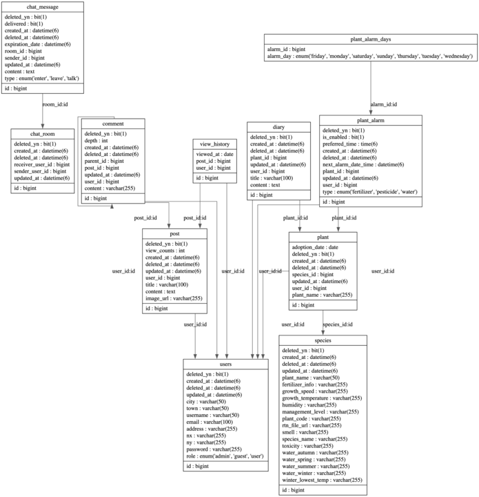

<div align="center">


</div>

<div align="center">
  <h2>Botanify</h2>
  <h3>식물 성장 기록 & 정보 공유 커뮤니티 서비스</h3>
</div>

### 🌱 목차
<hr>

- [서비스 소개](#-서비스-소개)
- [기술 스택](#-기술-스택)
- [설치 및 실행 방법](#-프로젝트-설치-및-실행법)
- [프로젝트 구조 ](#프로젝트-구조 )
- [주요 기능](#주요-기능)
- [Developer](#Developer)

### 💁‍♀️ 서비스 소개
<hr>
<p>🗓️ 개발기간: 2024.12.02 ~ 2025.01.07</p> 
<p>🪴 Botanify</p>

- 사용자가 자신의 식물을 관리하고, 성장 상태를 기록하며, 식물 관련 정보를 공유할 수 있도록 돕는 애플리케이션입니다.
- 저희의 목표는 식물 성장 일지를 기록하고 정보를 공유하는 커뮤니티 서비스를 제공하여, 사용자들의 식집사 생활을 더 쉽고 재미있게 만드는 것입니다.

<p>🎥 시연연상</p>

### 🔧 기술 스택
<hr>

#### Backend


#### DevOps & Tools


#### Design & Collaboration


### ⚙️ 프로젝트 설치 및 실행법
<hr>

#### 1. **필수 요구 사항**
프로젝트 실행 전에 아래 환경이 필요합니다.

- **Java 17** 이상
- **MySQL 8.0**
- **Docker**
- **Git**
- **IDE** (IntelliJ, Eclipse 등)

#### 2. **프로젝트 클론**

```bash
$git clone https://github.com/sparta-Sounganization/Botanify.git
$cd Botanify
```

#### 3. **파일 설정**

`src/main/resources/application.yml` 파일을 수정하여 데이터베이스 및 기타 설정을 업데이트하세요.

<details>
<summery>

```bash
spring:
  jpa:
    open-in-view: false
    hibernate:
      ddl-auto: none
    properties:
      hibernate:
        show_sql: true
        dialect: org.hibernate.dialect.MySQL8Dialect
  jackson:
    time-zone: Asia/Seoul

  # mySQL Configuration
  datasource:
    driver-class-name: com.mysql.cj.jdbc.Driver
    url: ${사용자의_mySQL_엔드포인트}
    username: ${mySQL_사용자_이름}
    password: ${mySQL_사용자_암호}

  # JWT Configuration
  jwt:
    secret:
      key: ${base64로_암호화된_JWT_비밀_키}
      expiration: 3600000 # 1시간

  # Google OAuth2 Configuration
  security:
    oauth2:
      client:
        registration:
          google:
            client-id: {Google_Client_ID}
            client-secret: {Google_Client_비밀_키}
            redirect-uri: "{baseUrl}/login/oauth2/code/{registrationId}"
            scope:
              - profile
              - email

  # Redis Configuration
  redis:
    master:
      port: 6379
      host: ${사용자의 Redis 클라이언트 엔드포인트}
    verification:
      ttl: 300  # 5분
      max-attempts: 5
      attempts-ttl: 3600 # 1시간

  # Email Configuration
  mail:
    host: smtp.gmail.com
    port: 587
    username: ${서비스_이메일_발신_이름}
    password: ${서비스_이메일_발신_암호}
    properties:
      mail:
        smtp:
          auth: true
          starttls:
            enable: true

# ============= ^ Spring ^ ============= v External v =============


# Global Logging Configuration
logging:
  level:
    org.springframework.security: INFO
    com.sounganization.botanify: DEBUG
    org.springframework.web: DEBUG
    io.github.resilience4j.circuitbreaker: DEBUG


# S3 Configuration
aws:
  s3:
    bucket: ${S3_버킷_이름}
    endpoint: ${S3_버킷_PUT_엔드포인트}
    gateway: ${S3_버킷_GET_게이트웨이}
  access-key: ${S3_인증_키}
  secret-key: ${S3_비밀_키}


# Monitoring Configuration
management:
  endpoints:
    web:
      exposure:
        include: circuitbreakers, health, info, prometheus


# Kakao API Configuration
kakao:
  api:
    key: ${kakao_인증_키}
    base-url: ${kakao_엔드포인트}


# weather API Configuration
weather:
  api:
    key: ${weather_인증_키}
    base-url: ${weather_엔드포인트}


# CircuitBreaker Configuration
resilience4j:
  circuitbreaker:
    instances:
      weatherService:
        slidingWindowType: COUNT_BASED # 슬라이딩 윈도우 타입
        slidingWindowSize: 10 # 슬라이딩 윈도우 크기
        minimumNumberOfCalls: 5 # 최소 호출 수
        failureRateThreshold: 50 # 실패율 임계값
        waitDurationInOpenState: 10s # 열림 상태 대기 시간 (10초)
        permittedNumberOfCallsInHalfOpenState: 3 # 반열림 상태 호출 수
        slowCallRateThreshold: 100 # 느린 호출 비율 임계값
        slowCallDurationThreshold: 3s # 느린 호출 지속 시간 (3초)


# plant API Configuration
nongsaro:
  api:
    base-url: ${nongsaro_엔드포인트}
    key: ${nongsaro_인증_키}


# OneSignal Configuration
onesignal:
  app-id: ${onesignal_app_id}
  rest-api-key: ${rest_api_key}
```

</summery>
</details>

#### 4. **Docker**

Docker를 사용하여 MySQL 및 필요한 서비스를 실행합니다.

```bash
$docker-compose up -d
```

#### 5. **어플리케이션 빌드**

Gradle을 사용하여 프로젝트를 빌드합니다.

```bash
$./gradlew build
```

에러가 발생하면 다음 명령어를 실행하세요.

```bash
$./gradlew clean build
```

#### 5. **어플리케이션 실행**

빌드가 완료되면 생성된 .jar 파일을 실행합니다.
프로젝트 디렉토리 build > libs에 만들어진 jar 파일 실행

```bash
$java -jar Botanify-0.0.1-SNAPSHOT.jar
```

### 📁 프로젝트 구조

<hr>

#### 서비스 아키텍쳐


#### ERD



#### API

- 방법1 (표로 만들어서 전부 기입, 내용이 기니깐 토글 사용)

- 일지 관리 API

| 기능    | Method | URL                                | Request                                    | Response                                                    |
|-------|--------|------------------------------------|--------------------------------------------|-------------------------------------------------------------|
| 일지 작성 | POST   | `/api/v1/plants/{plantId}/diaries` | `{ "diaryId": 1 }`                         | `{ "id": 1, "content": "일지 내용", "date": "2025-01-01" }`     |
| 일지 조회 | GET    | `/api/v1/diaries/{id}`             | `{ "diaryId": 1 }`                         | `{ "id": 1, "content": "일지 내용", "date": "2025-01-01" }`     |
| 일지 수정 | PUT    | `/api/v1/diaries/{id}`             | `{ "diaryId": 1, "content": "수정된 일지 내용" }` | `{ "id": 1, "content": "수정된 일지 내용", "date": "2025-01-01" }` |
| 일지 삭제 | DELETE | `/api/v1/diaries/{id}`             | `{ "diaryId": 1 }`                         | `{ "message": "일지 삭제 완료" }`                                 |

- 방법2 (문서로 링크 만듬)

```markdown
- [API 문서 바로가기](https://example.com/api-docs)
  postman에서 api 문서 만들어서 넣어도 좋을듯
```

### 🌿 주요기능

<hr>

1. 사용자 관리
<table>
  <tr>
    <td></td>
    <td></td>
    <td></td>
  </tr>
  <tr>
    <td>메인</td>
    <td>회원가입</td>
    <td>로그인</td>

  </tr>
</table>

- **메인**: 인기 게시글을 볼 수 있으며, 로그인 후에는 인기글과 자신의 식물을 볼 수 있습니다.
- **회원가입/ 로그인**: 사용자는 계정을 생성하고, 로그인할 수 있습니다.

2. 식물 관리
<table>
  <tr>
    <td></td>
    <td></td>
    <td></td> 
    <td></td> 
  </tr>
  <tr>
    <td>식물 등록 및 관리</td>
    <td>식물 성장 기록</td>
    <td>식물 정보 조회</td>
    <td>식물 관리 알림</td>
  </tr>
</table>

- **식물 등록 및 관리**: 사용자가 자신의 식물을 등록하고 관리할 수 있습니다.
- **식물 정보 조회**: 계절별 관수 정보, 습도 등의 식물의 관리 정보를 제공합니다.
- **식물 성장 기록**: 식물의 성장 일지 및 사진을 기록할 수 있습니다.
- **식물 관리 알림**: 물 주기 알림, 비료 알림 등 알림을 설정할 수 있습니다.

3. 커뮤니케이션

<table>
  <tr>
    <td></td>
    <td></td>
  </tr>

  <tr>
    <td>채팅</td>
    <td>게시판</td>
  </tr>
</table>

- **채팅 기능**: 다른 사용자와 1:1 소통할 수 있는 기능을 제공합니다.
- **게시판 기능**: 사용자 간 정보 공유 및 커뮤니티 활동을 위한 게시판을 제공합니다.

### 👨‍💻 Developer

<hr>

| 이름  | 역할      | GitHub                                           |  
|-----|---------|--------------------------------------------------|  
| 장재혁 | Backend | [GitHub Link](https://github.com/34-43)          |  
| 김동주 | Backend | [GitHub Link](https://github.com/Despereaux-MAU) |  
| 고아라 | Backend | [GitHub Link](https://github.com/arago07)        | 
| 소성  | Backend | [GitHub Link](https://github.com/gbognon25)      |                  |
| 지민지 | Backend | [GitHub Link](https://github.com/JIMINJI1)       |  
