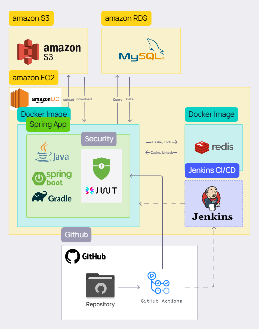
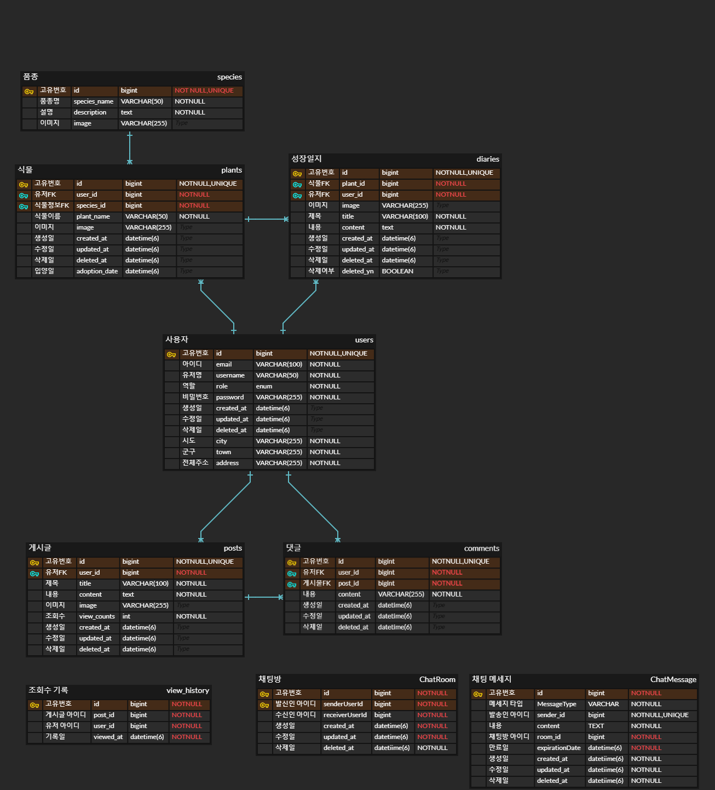

<div align="center">


</div>

<div align="center">
  <h2>Botanify</h2>
  <h3>식물 성장 기록 & 정보 공유 커뮤니티 서비스</h3>
</div>


### 🌱 목차
<hr>

- [서비스 소개](#-서비스-소개)
- [기술 스택](#-기술-스택)
- [설치 및 실행 방법](#-프로젝트-설치-및-실행법)
- [프로젝트 구조 ](#프로젝트-구조 )
- [주요 기능](#주요-기능)
- [Developer](#Developer)

### 💁‍♀️ 서비스 소개 
<hr>
<p>🗓️ 개발기간: 2024.12.01 ~ 2025.01.07</p> 

**🪴 Botanify**는 사용자가 자신의 식물을 관리하고, 성장 상태를 기록하며, 식물 관련 정보를 공유할 수 있도록 돕는 애플리케이션입니다.
저희의 목표는 식물 성장 일지를 기록하고 정보를 공유하는 커뮤니티 서비스를 제공하여, 사용자들의 식집사 생활을 더 쉽고 재미있게 만드는 것입니다.

<p>🎥 시연연상</p>


### 🔧 기술 스택
<hr>

#### Backend


#### DevOps & Tools


#### Design & Collaboration


### ⚙️ 프로젝트 설치 및 실행법
<hr>

#### 1. **필수 요구 사항**
프로젝트 실행 전에 아래 환경이 필요합니다
- **Java 17** 이상
- **MySQL 8.0**
- **Docker** (선택 사항)
- **Git**
- IDE (IntelliJ, Eclipse 등)

#### 2. **프로젝트 클론**
```bash
git clone https://github.com/sparta-Sounganization/Botanify.git
```

#### 3. ** 파일 설정  **
applicaion.yml 수정
```bash
내용
```

### 📁  프로젝트 구조 
<hr>

#### 서비스 아키텍쳐 

 
  
#### ERD




#### API
- 방법1 (표로 만들어서 전부 기입, 내용이 기니깐 토글 사용)

- 일지 관리 API

| 기능    | Method | URL                                 | Request                            | Response                            |
|-------|--------|-------------------------------------|------------------------------------|-------------------------------------|
| 일지 작성 | POST   | `/api/v1/plants/{plantId}/diaries`  | `{ "diaryId": 1 }`                | `{ "id": 1, "content": "일지 내용", "date": "2025-01-01" }` |
| 일지 조회 | GET    | `/api/v1/diaries/{id}`              | `{ "diaryId": 1 }`                | `{ "id": 1, "content": "일지 내용", "date": "2025-01-01" }` |
| 일지 수정 | PUT    | `/api/v1/diaries/{id}`              | `{ "diaryId": 1, "content": "수정된 일지 내용" }` | `{ "id": 1, "content": "수정된 일지 내용", "date": "2025-01-01" }` |
| 일지 삭제 | DELETE | `/api/v1/diaries/{id}`              | `{ "diaryId": 1 }`                | `{ "message": "일지 삭제 완료" }`    |


- 방법2 (문서로 링크 만듬)
```markdown
- [API 문서 바로가기](https://example.com/api-docs)
postman에서 api 문서 만들어서 넣어도 좋을듯
```

### 🌿 주요기능
<hr>

1. 사용자 관리

 |  |  |
 |------------------------|------------------------|
 | 홈 화면                | 로그인 화면            |

- **홈화면**: 인기 게시글을 볼 수 있으며, 로그인 후에는 인기글과 자신의 식물을 볼 수 있습니다.
- **회원가입/ 로그인**: 사용자는 계정을 생성하고, 로그인할 수 있습니다.


2. 식물 관리

 |  |  |  |  |
 |------------------------|------------------------|------------------------|------------------------|
 | 식물 등록              | 식물 정보 조회         | 식물 성장 기록         | 식물 관리 알림         |

- **식물 등록 및 관리**: 사용자가 자신의 식물을 등록하고 관리할 수 있습니다.
- **식물 정보 조회**: 계절별 관수 정보, 습도 등의 식물의 관리 정보를 제공합니다.
- **식물 성장 기록**: 식물의 성장 일지 및 사진을 기록할 수 있습니다.
- **식물 관리 알림**: 물 주기 알림, 비료 알림 등 알림을 설정할 수 있습니다.


3. 커뮤니케이션

 |  |  |
 |------------------------|------------------------|
 | 채팅 기능              | 게시판 기능            |

- **채팅 기능**: 다른 사용자와 1:1 소통할 수 있는 기능을 제공합니다.
- **게시판 기능**: 사용자 간 정보 공유 및 커뮤니티 활동을 위한 게시판을 제공합니다.


### 👨‍💻 Developer
<hr>

| 이름   | 역할     | GitHub                                |  
|------|--------|---------------------------------------|  
| 장재혁  | Backend | [GitHub Link](https://github.com/34-43) |  
| 김동주  | Backend | [GitHub Link](https://github.com/Despereaux-MAU) |  
| 고아라  | Backend | [GitHub Link](https://github.com/arago07) | 
| 소성   | Backend | [GitHub Link](https://github.com/gbognon25) |                  |
| 지민지  | Backend | [GitHub Link](https://github.com/JIMINJI1) |  


